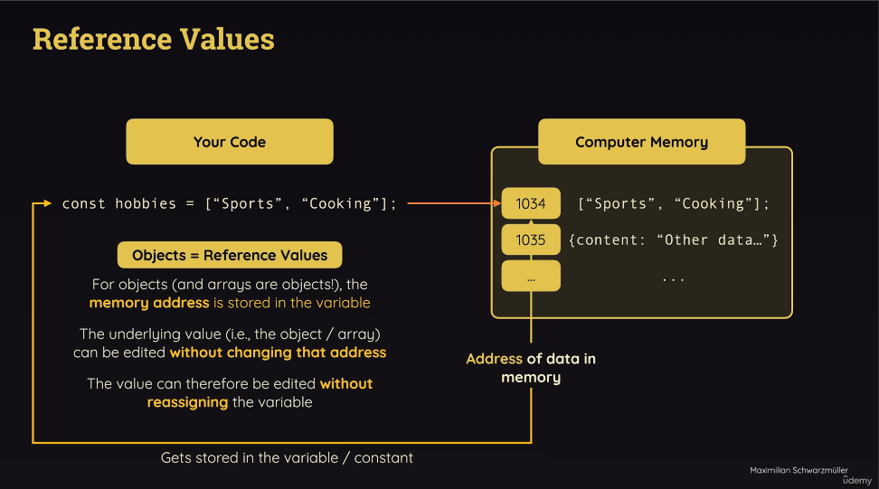

# Reference vs Primitive Values.
> If we get a string here below that is a primitive value. <br>
> String, number, booleans are all primitive. <br>
> We can not edit primitives. We can overwrite but that is a brand new string. Old string will be thrown away and that is not edit. Even when we call a new method on it. It will produce new string.
```
let userName = 'Hello';
userMessage = userMessage.concat("!!!");
```
> This changes when we are dealing with objects and arrays. 
> Objects are reference values. Simply means in a variables we do not store the values but instead address of that value in memory.
```
// 
const hobbies = ["Sports", "Cooking"];
hobbies.push("Working");
console.log(hobbies);
```


### Filter Function JavaScript.
> https://developer.mozilla.org/en-US/docs/Web/JavaScript/Reference/Global_Objects/Array/filter

### Link to Code Sand Box.
> https://codesandbox.io/s/javascript-refresher-j56djd